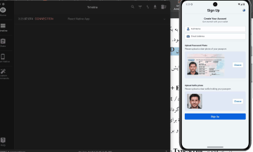

# توضیحات لازم جهت اجرا و راه اندازی اپلیکیشن

This application tested on both android and iOS devices

## مرحله اول: سیستم مورد نیاز

- node v22.9.0
- Gradle 9.0.0
- Kotlin 2.2.0
- Launcher JVM 17.0.11
- iOS SDKs iOS 17.2

## مرحله دوم: دانلود و نصب موارد مورد نیاز

```sh
# clone project
git clone https://github.com/moloudayat/MyWallet.git

# add local.properties which indicates the sdk location to android folder

# install dependencies
npm install

```

## مرحله سوم اجرای اپلیکیشن

### Android

در ترمینال این دستورها را وارد کنید

```sh
npm run android

# for server
npm run mock:server
```

### IOS

```sh
npm run ios

# for server
npm run mock:server
```

## Demo

دموی برنامه در مسیر `/demo/` قرار دارد



[Video (MOV)](./demo/Screen%20Recording%202026-02-25%20at%203.25.29%E2%80%AFPM.mov)

## Back-end

وب سرویس ها و توضیحات آن‌ها در مسیر `/mock-server/` وجود دارد
